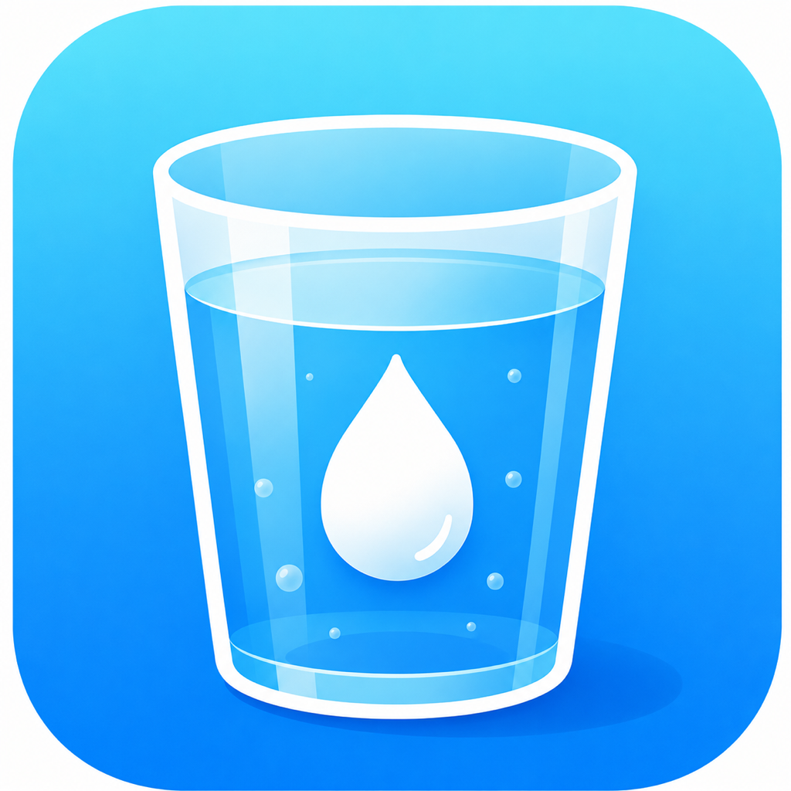
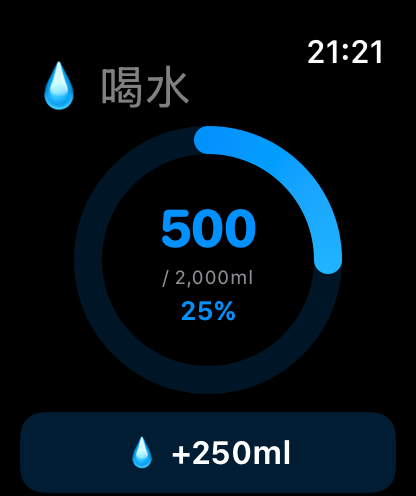
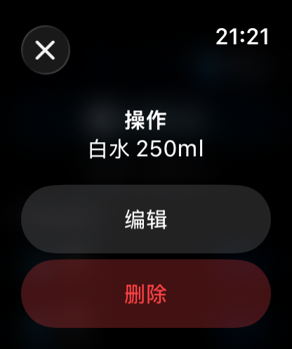
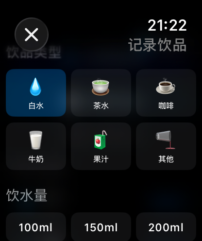

# 💧 喝水记录 (DrinkTrackerWatch)

一款简洁优雅的 Apple Watch 饮水追踪应用，帮助你养成每日健康饮水习惯。

<div align="center">
  
</div>

## ✨ 功能特性

- **📊 每日进度追踪** — 精美环形进度条，实时显示饮水完成百分比
- **⚡ 快速记录** — 一键记录 250ml 白水，无需额外操作
- **🫗 多饮品类型** — 支持白水、茶水、咖啡、牛奶、果汁等 6 种饮品
- **📝 自定义容量** — 提供 100ml ~ 500ml 多种容量选项
- **✏️ 编辑与删除** — 长按记录即可编辑或删除，操作便捷
- **↩️ 撤销删除** — 误删后 4 秒内可一键撤销
- **🎯 目标达成提醒** — 达到每日饮水目标时显示庆祝动画
- **💾 本地持久化** — 数据安全存储在设备本地，自动清理历史记录

## 📱 界面预览

<div align="center">
  <table>
    <tr>
      <td align="center">
        <br>
        <b>主页 — 进度环 & 今日记录</b>
      </td>
      <td align="center">
        <br>
        <b>记录饮品 — 选择类型与容量</b>
      </td>
      <td align="center">
        <br>
        <b>编辑记录 — 修改已有记录</b>
      </td>
    </tr>
  </table>
</div>

## 🛠 技术栈

| 技术 | 说明 |
|------|------|
| **SwiftUI** | 声明式 UI 框架 |
| **watchOS 10+** | 最低支持系统版本 |
| **Swift 5.9** | 开发语言 |
| **XcodeGen** | 项目管理（`project.yml`） |
| **UserDefaults** | 本地数据持久化 |

## 📂 项目结构

```
DrinkTrackerWatch/
├── DrinkTrackerWatch/
│   ├── DrinkTrackerWatchApp.swift      # App 入口
│   ├── ContentView.swift               # 主页面（进度环 + 记录列表）
│   ├── Models/
│   │   └── WatchModels.swift           # 数据模型 & 数据管理器
│   ├── Views/
│   │   ├── RecordDrinkView.swift       # 记录饮品页面
│   │   └── EditRecordSheet.swift       # 编辑记录弹窗
│   └── Assets.xcassets/                # 应用资源
├── screenshots/                        # 应用截图
├── project.yml                         # XcodeGen 配置
└── DrinkTrackerWatch.xcodeproj/        # Xcode 项目文件
```

## 🚀 快速开始

### 环境要求

- macOS + Xcode 15.0+
- watchOS 10.0+ 模拟器或 Apple Watch 真机

### 安装与运行

1. **克隆仓库**
   ```bash
   git clone https://github.com/your-username/DrinkTrackerWatch.git
   cd DrinkTrackerWatch
   ```

2. **生成 Xcode 项目**（如已存在 `.xcodeproj` 可跳过）
   ```bash
   brew install xcodegen
   xcodegen generate
   ```

3. **打开并运行**
   ```bash
   open DrinkTrackerWatch.xcodeproj
   ```
   选择 watchOS 模拟器或已连接的 Apple Watch，点击 ▶️ 运行。

## 📖 使用说明

1. 打开应用后，主页显示当日饮水进度环
2. 点击 **"+250ml"** 快速记录一杯白水
3. 点击 **"记录饮品"** 选择饮品类型和容量
4. 点击今日记录条目可 **编辑** 或 **删除**
5. 删除后 4 秒内可通过底部 Toast **撤销**
6. 每日默认目标 **2000ml**，达到目标会有庆祝提示 🎉

## 📄 License

MIT License

---

<div align="center">
  <sub>用 ❤️ 为 Apple Watch 打造</sub>
</div>
## 🔧 构建脚本

项目提供了一键构建运行脚本 `run.sh`：

```bash
./run.sh          # 完整流程：生成项目 + 构建 + 启动模拟器 + 安装运行
./run.sh gen      # 仅生成 Xcode 项目（需要 xcodegen）
./run.sh build    # 仅构建
./run.sh run      # 仅运行到模拟器（需先构建）
./run.sh clean    # 清理构建缓存
./run.sh help     # 显示帮助
```

> 首次使用前请确保已安装 xcodegen：`brew install xcodegen`
